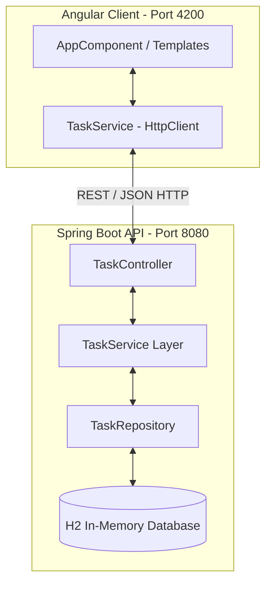

# 💻 Fullstack Task Manager — Java (Spring Boot) & Angular

<div align="center">


<p align="center">
  <b>Projeto prático de desenvolvimento Fullstack focado em aplicação de Padrões de Projeto, Boas Práticas e Arquitetura de Software com Java Spring Boot e Angular.</b>
</p>

</div>

---

## 📌 Sobre o Projeto

Este projeto foi desenvolvido com foco no **aprendizado prático e consolidação de conhecimentos em engenharia de software fullstack**. Tratase de um gerenciador de tarefas (To-Do List / Task Manager) completo, integrando um backend em **Java 17 / Spring Boot 3** a um frontend reativo em **Angular 17**.

Além da funcionalidade de CRUD completo, o projeto explora conceitos essenciais de desenvolvimento moderno, como **arquitetura em camadas**, **injeção de dependência**, **programação reativa com RxJS**, **validação de dados** e **filtros dinâmicos**.

---

## 🧠 Conceitos e Competências Aprendidas

### ☕ Backend (Java & Spring Boot)
- **Arquitetura em Camadas (Layered Architecture)**: Separação clara de responsabilidades entre `Controller`, `Service`, `Repository` e `Entity`.
- **Inversão de Controle e Injeção de Dependência (IoC / DI)**: Gerenciamento de beans via container do Spring (`@Service`, `@RestController`, `@Autowired`/Construtores).
- **Mapeamento Objeto-Relacional (ORM / JPA)**: Mapeamento de entidades com JPA/Hibernate, uso de `@Entity`, `@Table`, `@Enumerated(EnumType.STRING)` e hooks `@PrePersist`.
- **Repository Pattern**: Abstração do acesso a dados utilizando `JpaRepository` com suporte a query methods customizados.
- **Tratamento de Exceções e Validação**: Validação sintática nos DTOs/Entities usando Jakarta Validation (`@NotBlank`, `@Valid`) e tratamento adequado de códigos HTTP (`200 OK`, `201 Created`, `204 No Content`, `404 Not Found`).
- **Configuração de CORS**: Liberação granular de origens para permitir comunicação segura com a aplicação cliente em Angular.

### 🅰️ Frontend (Angular & TypeScript)
- **Standalone Components**: Uso da abordagem moderna do Angular sem necessidade de `NgModule`.
- **Programação Reativa com RxJS**: Manipulação de fluxos assíncronos de dados via `Observable`, `subscribe` e operadores de transformação.
- **Consumo de APIs REST**: Centralização das chamadas HTTP em um `TaskService` injetável (`HttpClient`).
- **Gerenciamento de Estado do Componente**: Manipulação e filtragem em tempo real no cliente (busca por texto, filtro por prioridade e por status).
- **Data Binding**: Utilização de Two-way data binding (`[(ngModel)]`), Property Binding (`[ngClass]`) e Event Binding.

---

## 🏗️ Padrões de Projeto e Arquitetura



### 💎 Principais Design Patterns Aplicados:
1. **Layered Architecture Pattern**: Organização estrutural em camadas isoladas para manter alta coesão e baixo acoplamento.
2. **Repository Pattern**: Desacoplamento da camada de negócios da tecnologia de persistência.
3. **DTO (Data Transfer Object) Pattern**: Transferência enxuta de dados entre o cliente Angular e a API Java.
4. **Singleton Pattern**: Instâncias de serviços gerenciadas pelo container de DI do Spring e pelo `providedIn: 'root'` do Angular.

---

## 🔍 Destaques de Código

### 1. Controller REST (Spring Boot)
Trecho demonstrando injeção via construtor, manipulação de `ResponseEntity` e parâmetros opcionais de busca:

```java
@RestController
@RequestMapping("/api/tasks")
@CrossOrigin(origins = {"http://localhost:4200", "*"})
public class TaskController {

    private final TaskService taskService;

    public TaskController(TaskService taskService) {
        this.taskService = taskService;
    }

    @GetMapping
    public ResponseEntity<List<Task>> getAllTasks(
            @RequestParam(required = false) Boolean completed,
            @RequestParam(required = false) Priority priority) {
        if (completed != null) {
            return ResponseEntity.ok(taskService.getTasksByStatus(completed));
        }
        if (priority != null) {
            return ResponseEntity.ok(taskService.getTasksByPriority(priority));
        }
        return ResponseEntity.ok(taskService.getAllTasks());
    }
}
```

### 2. Serviço Angular Reativo (TypeScript + RxJS)
Centralização da comunicação assíncrona com tratamento tipado:

```typescript
@Injectable({
  providedIn: 'root'
})
export class TaskService {
  private apiUrl = 'http://localhost:8080/api/tasks';

  constructor(private http: HttpClient) {}

  getTasks(): Observable<Task[]> {
    return this.http.get<Task[]>(this.apiUrl);
  }

  toggleTaskStatus(id: number): Observable<Task> {
    return this.http.patch<Task>(`${this.apiUrl}/${id}/toggle`, {});
  }
}
```

---

## 🛠️ Tecnologias e Ferramentas

| Camada | Tecnologia | Utilização |
| :--- | :--- | :--- |
| **Backend** | Java 17 | Linguagem principal do servidor |
| **Backend** | Spring Boot 3 | Framework para criação de APIs REST |
| **Backend** | Spring Data JPA | Abstração de persistência no banco |
| **Backend** | H2 Database | Banco de dados SQL em memória para desenvolvimento |
| **Frontend** | Angular 17 | Framework SPA para interface do usuário |
| **Frontend** | TypeScript | Superset tipado para lógica do cliente |
| **Frontend** | RxJS & HttpClient | Comunicação HTTP assíncrona e reativa |
| **Frontend** | Vanilla CSS3 | Estilização moderna com Flexbox e variáveis CSS |

---

## 🚦 Como Executar o Projeto Localmente

### Pré-requisitos
- Java JDK 17 ou superior
- Node.js 18+ e npm
- Angular CLI (`npm install -g @angular/cli`)

### Step-by-Step

```bash
# 1. Clonar o repositório
git clone https://github.com/lisboainformatica/crud.git
cd crud

# 2. Iniciar o Backend (Spring Boot)
cd backend
./mvnw spring-boot:run   # No Windows: .\mvnw.cmd spring-boot:run

# O servidor rodará em http://localhost:8080
# H2 Console disponível em http://localhost:8080/h2-console

# 3. Iniciar o Frontend (Angular) - em outro terminal
cd ../frontend
npm install
ng serve --open

# A aplicação abrirá em http://localhost:4200
```

---

## 📬 Endpoints da API REST

| Método | Endpoint | Descrição | Status HTTP |
| :--- | :--- | :--- | :--- |
| `GET` | `/api/tasks` | Retorna lista de tarefas (filtro opcional por `completed` e `priority`) | `200 OK` |
| `GET` | `/api/tasks/{id}` | Busca tarefa por ID | `200 OK` / `404 Not Found` |
| `POST` | `/api/tasks` | Cadastra nova tarefa | `201 Created` |
| `PUT` | `/api/tasks/{id}` | Atualiza todos os dados de uma tarefa | `200 OK` / `404 Not Found` |
| `PATCH` | `/api/tasks/{id}/toggle` | Alterna o status da tarefa (concluída/pendente) | `200 OK` / `404 Not Found` |
| `DELETE` | `/api/tasks/{id}` | Remove uma tarefa do sistema | `204 No Content` |

---

<div align="center">
  <p>Projeto desenvolvido por <b>Vinicius Andrade</b> como demonstração prática de habilidades Fullstack em Java & Angular.</p>
</div>
